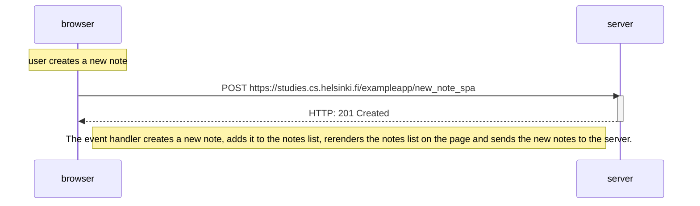

```mermaid
sequenceDiagram
    participant browser
    participant server

    Note over browser: user creates a new note
    browser->>server: POST https://studies.cs.helsinki.fi/exampleapp/new_note_spa
    activate server
    server-->>browser: HTTP: 201 Created
    deactivate server
    note right of browser: The event handler creates a new note, adds it to the notes list, rerenders the notes list on the page and sends the new notes to the server.
    
    
```